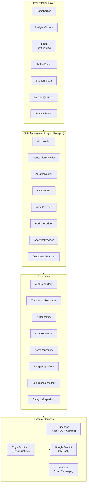
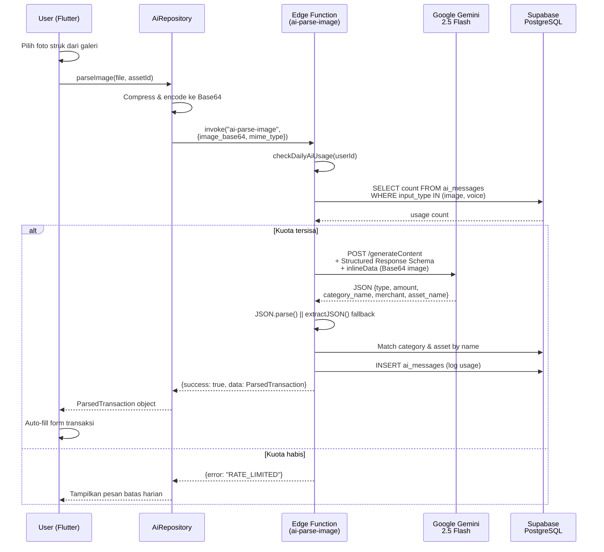
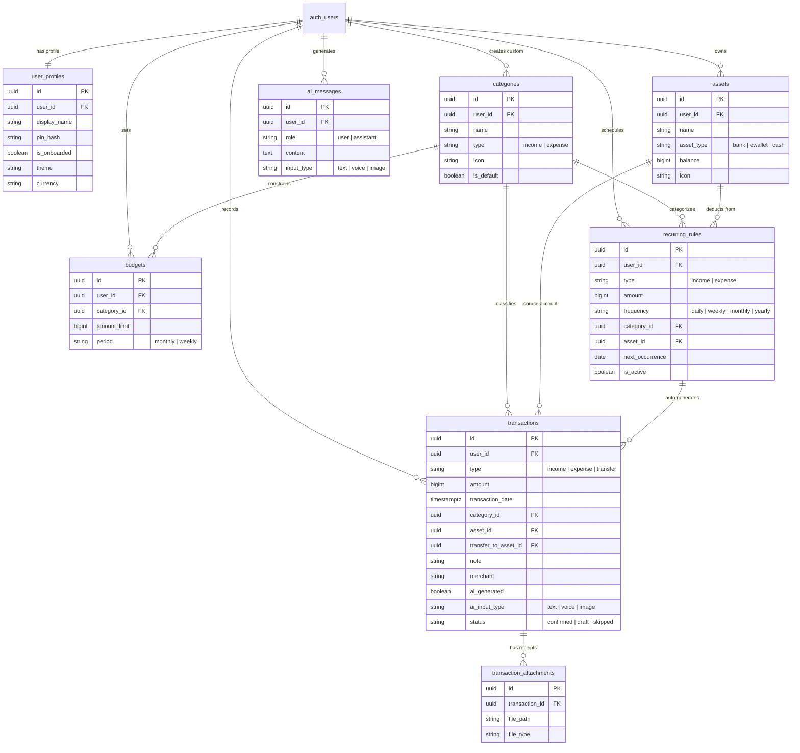

<div align="center">

# FinAI - Intelligent Financial Tracker

### AI-Powered Personal Finance Management Application

Built with modern mobile architecture and multimodal artificial intelligence

[](https://flutter.dev)
[](https://dart.dev)
[](https://supabase.com)
[](https://ai.google.dev)
[](https://firebase.google.com)
[](https://deno.land)
[](https://www.postgresql.org)

---

**[Demo Video](#-demo-aplikasi)** | **[Instalasi](#-instalasi--cara-menjalankan)** | **[Arsitektur](#-arsitektur-sistem)** | **[Tech Stack](#-technology-stack--library)**

</div>

---

## Deskripsi

**FinAI** adalah sistem manajemen keuangan pribadi berbasis kecerdasan buatan (AI) multimodal yang dirancang untuk mengotomatisasi pencatatan transaksi keuangan. Aplikasi ini menggabungkan teknologi **Computer Vision** dan **Natural Language Processing** dari Google Gemini untuk mengekstrak data finansial dari foto struk belanja maupun perintah suara, menghilangkan hambatan input manual yang selama ini menjadi penyebab utama kegagalan konsistensi pencatatan keuangan.

---

## Demo Aplikasi

Video demonstrasi lengkap FinAI tersedia di tautan berikut:

> **[Tonton Video Demo FinAI di Google Drive](https://drive.google.com/drive/folders/1d9zsDj80XVgeccTvx8CXiNqXpxrSJ_Uq?usp=sharing)**

---

## Fitur Utama

### 1. AI Receipt Scanner (Pemindai Struk Cerdas)
Pengguna mengunggah foto struk belanja. Sistem melakukan konversi citra ke format biner Base64, mengirimnya ke Supabase Edge Functions, lalu meneruskannya ke model **Google Gemini 2.5 Flash Multimodal** dengan konfigurasi *Structured Response Schema*. AI mengekstrak nominal, kategori, nama merchant, dan dompet pembayaran secara otomatis.

### 2. AI Voice Transaction (Input Suara Cerdas)
Pengguna merekam perintah suara dalam bahasa Indonesia. Audio di-encode ke Base64, dikirim ke Edge Function `ai-parse-voice`, di mana Gemini melakukan **Speech-to-Text** sekaligus **NLP extraction** untuk memecah kalimat natural menjadi entitas finansial terstruktur (nominal, kategori, dompet, merchant).

### 3. AI Financial Chatbot
Asisten keuangan berbasis percakapan yang mampu menjawab pertanyaan terkait kondisi finansial pengguna berdasarkan data transaksi yang tersimpan di database.

### 4. Financial Health Score
Skor kesehatan keuangan otomatis yang dihitung berdasarkan rasio pemasukan vs pengeluaran, kepatuhan terhadap anggaran, dan distribusi kategori belanja pengguna.

### 5. Analitik Finansial Visual
Grafik interaktif yang menampilkan distribusi pengeluaran per kategori (Pie Chart), tren arus kas bulanan (Line Chart), dan ringkasan saldo harian yang dirender menggunakan library **FL Chart** secara real-time.

### 6. Manajemen Multi-Aset
Pelacakan saldo terpisah untuk berbagai sumber dana: rekening bank (BCA, Mandiri, dll.), dompet digital (OVO, GoPay, DANA), dan kas tunai.

### 7. Sistem Anggaran (Budget Thresholding)
Penetapan batas pengeluaran per kategori dengan pemantauan realisasi real-time. Sistem memberikan peringatan visual saat pengeluaran mendekati atau melampaui batas.

### 8. Transaksi Berulang (Recurring)
Penjadwalan otomatis untuk tagihan berkala seperti listrik, cicilan, dan langganan. Sistem mengeksekusi pencatatan secara periodik sesuai interval yang dikonfigurasi.

### 9. Ekspor/Impor Data (.xlsx)
Interoperabilitas data melalui format spreadsheet standar untuk backup, migrasi, atau analisis lanjutan di aplikasi eksternal.

### 10. Keamanan Berlapis
Autentikasi melalui email OTP dan Google SSO (Supabase Auth), proteksi PIN 6 digit, serta biometric lock (sidik jari) menggunakan library `local_auth`. Credential disimpan terenkripsi via `flutter_secure_storage`.

---

## Technology Stack & Library

### Core Framework

| Teknologi | Fungsi | Versi |
| :--- | :--- | :--- |
|  | Framework UI cross-platform | 3.x |
|  | Bahasa pemrograman utama | ^3.11.0 |
|  | Backend-as-a-Service (Auth, DB, Storage, Edge Functions) | ^2.5.0 |
|  | Relational database (via Supabase) | 15 |

### AI & Cloud Services

| Teknologi | Fungsi | Versi |
| :--- | :--- | :--- |
|  | AI multimodal (vision + audio + NLP) | v1beta |
|  | Runtime untuk Supabase Edge Functions | Latest |
|  | Push notification service | ^14.9.0 |

### State Management & Navigation

| Library | Fungsi |
| :--- | :--- |
|  | Reactive state management (Provider + Code Generation) |
| `go_router` ^13.0.0 | Declarative routing dengan deep linking & redirect guards |
| `freezed` ^2.5.0 | Immutable data class & union type code generation |
| `json_serializable` ^6.8.0 | Automated JSON serialization/deserialization |

### UI & Visualization

| Library | Fungsi |
| :--- | :--- |
| `fl_chart` ^0.68.0 | Grafik interaktif (Pie, Line, Bar chart) |
| `google_fonts` ^6.2.0 | Tipografi modern (Inter, Roboto, dll.) |
| `shimmer` ^3.0.0 | Skeleton loading placeholder |
| `flutter_markdown` ^0.7.7 | Render konten markdown di chatbot AI |

### Media & File Processing

| Library | Fungsi |
| :--- | :--- |
| `image_picker` ^1.2.2 | Pengambilan foto dari kamera / galeri |
| `camera` ^0.11.0 | Akses kamera native |
| `record` ^5.2.1 | Perekaman audio (voice transaction) |
| `file_picker` ^8.0.0 | Pemilihan file untuk import data |
| `excel` ^4.0.6 | Generate & parse file .xlsx |
| `share_plus` ^9.0.0 | Share file ke aplikasi lain |

### Security & Authentication

| Library | Fungsi |
| :--- | :--- |
| `supabase_flutter` ^2.5.0 | Auth (Email OTP, Google SSO, JWT) |
| `local_auth` ^2.2.0 | Biometric authentication (fingerprint) |
| `flutter_secure_storage` ^9.0.0 | Encrypted credential storage |

### Database & Persistence

| Library | Fungsi |
| :--- | :--- |
| `drift` ^2.18.0 | Type-safe SQLite ORM (local database) |
| `sqlite3_flutter_libs` ^0.5.0 | Native SQLite bindings |
| `shared_preferences` ^2.5.5 | Key-value local storage |

### Networking & Monitoring

| Library | Fungsi |
| :--- | :--- |
| `dio` ^5.4.0 | HTTP client dengan interceptor support |
| `connectivity_plus` ^6.0.0 | Deteksi status koneksi jaringan |
| `sentry_flutter` ^8.14.2 | Error tracking & crash reporting |
| `flutter_local_notifications` ^17.0.0 | Notifikasi lokal terjadwal |

---

## Arsitektur Sistem

### High-Level Architecture

```
                                    FinAI System Architecture
  +-----------------------------------------------------------------------+
  |                                                                       |
  |   +-------------------+         HTTPS/JWT         +----------------+  |
  |   |   Flutter Client  | <======================> |    Supabase     |  |
  |   |   (Android APK)   |                          |    Platform    |  |
  |   |                   |         REST API          |                |  |
  |   |  +-------------+  | -----------------------> | +------------+ |  |
  |   |  | Riverpod    |  |                          | | PostgreSQL | |  |
  |   |  | Providers   |  |         Realtime         | | + RLS      | |  |
  |   |  +------+------+  | <~~~~~~~~~~~~~~~~~~~~~~> | +------------+ |  |
  |   |         |         |                          |                |  |
  |   |  +------+------+  |    invoke() via SDK      | +------------+ |  |
  |   |  | Repositories|  | -----------------------> | | Edge Funcs | |  |
  |   |  +-------------+  |                          | | (Deno)     | |  |
  |   |                   |                          | +-----+------+ |  |
  |   |  +-------------+  |                          |       |        |  |
  |   |  | Drift (SQL) |  |   Local Cache            | +-----+------+ |  |
  |   |  +-------------+  |                          | | Object     | |  |
  |   +-------------------+                          | | Storage    | |  |
  |                                                  | +------------+ |  |
  |                                                  +-------+--------+  |
  |                                                          |           |
  |                                              +-----------+---------+ |
  |                                              | Google Gemini 2.5   | |
  |                                              | Flash (Multimodal)  | |
  |                                              +---------------------+ |
  +-----------------------------------------------------------------------+
```

### Arsitektur Aplikasi Flutter (Layered Architecture)



### Alur Pemrosesan AI (Scan Struk)



---

## Skema Database (Entity Relationship Diagram)

Sistem database menggunakan **PostgreSQL** melalui Supabase dengan penerapan **Row Level Security (RLS)** pada seluruh tabel untuk isolasi data antar pengguna.



### Deskripsi Tabel

| Tabel | Deskripsi |
| :--- | :--- |
| `user_profiles` | Preferensi pengguna: tema, PIN hash, status onboarding, mata uang default |
| `categories` | Klasifikasi transaksi (Makanan, Transportasi, Gaji, dll.) dengan dukungan kategori kustom |
| `assets` | Entitas penyimpan dana: rekening bank, e-wallet, kas tunai beserta saldo real-time |
| `transactions` | Record inti perpindahan dana dengan metadata AI (sumber input, merchant, lampiran) |
| `budgets` | Plafon pengeluaran per kategori dengan periode bulanan/mingguan |
| `recurring_rules` | Konfigurasi transaksi otomatis berulang (tagihan listrik, cicilan, langganan) |
| `transaction_attachments` | File lampiran struk/bukti yang disimpan di Supabase Object Storage |
| `ai_messages` | Log percakapan chatbot AI dan tracking penggunaan kuota scan/voice |

---

## Supabase Edge Functions

Seluruh pemrosesan AI berjalan di server-side melalui Deno Edge Functions untuk menjaga keamanan API key:

| Edge Function | Deskripsi |
| :--- | :--- |
| `ai-parse-image` | Menerima Base64 gambar struk, meneruskan ke Gemini dengan Structured Schema, mengembalikan data transaksi terstruktur |
| `ai-parse-voice` | Menerima Base64 audio, melakukan transkripsi + NLP extraction via Gemini, mengembalikan data transaksi |
| `ai-parse-text` | Parsing perintah teks natural menjadi entitas transaksi |
| `ai-chat` | Backend chatbot AI untuk konsultasi keuangan berbasis konteks data pengguna |
| `health-score` | Kalkulasi skor kesehatan finansial berdasarkan rasio dan distribusi transaksi |
| `export-excel` | Generate file .xlsx dari data transaksi pengguna |
| `import-excel` | Parse dan validasi file .xlsx untuk impor batch transaksi |
| `generate-recurring` | Cron job untuk mengeksekusi transaksi berulang sesuai jadwal |
| `send-notification` | Pengiriman push notification via Firebase Cloud Messaging |

---

## Instalasi & Cara Menjalankan

### Prasyarat Sistem

| Komponen | Versi Minimum | Catatan |
| :--- | :--- | :--- |
| Flutter SDK | 3.x | [Panduan instalasi Flutter](https://docs.flutter.dev/get-started/install) |
| Dart SDK | ^3.11.0 | Terinstal otomatis bersama Flutter |
| Android Studio / VS Code | Latest | Dengan plugin Flutter & Dart |
| Supabase CLI | Latest | `npm install -g supabase` |
| Node.js | 18+ | Untuk menjalankan Supabase CLI |
| Git | Latest | Version control |

### Langkah 1: Clone Repository

```bash
git clone https://github.com/Vraken9/FinAI.git
cd FinAI
```

### Langkah 2: Konfigurasi Environment Variables

Buat file `.env` di root project:

```env
SUPABASE_URL=<your_supabase_project_url>
SUPABASE_ANON_KEY=<your_supabase_anon_key>
```

### Langkah 3: Instal Dependencies

```bash
flutter pub get
```

### Langkah 4: Generate Kode (Freezed, JSON Serializable, Riverpod)

```bash
dart run build_runner build --delete-conflicting-outputs
```

### Langkah 5: Jalankan Aplikasi (Mode Debug)

```bash
# Pastikan emulator/perangkat Android terhubung
flutter run
```

### Langkah 6: Build APK Release (Opsional)

```bash
flutter build apk --release --split-per-abi
```

File APK akan tersedia di:
```
build/app/outputs/flutter-apk/
  ├── app-arm64-v8a-release.apk     (HP modern 64-bit)
  ├── app-armeabi-v7a-release.apk   (HP lama 32-bit)
  └── app-x86_64-release.apk        (Emulator)
```

### Setup Backend (Supabase Edge Functions)

Untuk deployment Edge Functions (memerlukan akses ke project Supabase):

```bash
# Login ke Supabase
npx supabase login

# Link ke project
npx supabase link --project-ref <project_ref>

# Deploy semua Edge Functions
npx supabase functions deploy ai-parse-image
npx supabase functions deploy ai-parse-voice
npx supabase functions deploy ai-chat
npx supabase functions deploy health-score
npx supabase functions deploy export-excel
npx supabase functions deploy import-excel
```

---

## Struktur Direktori Project

```
FinAI/
├── lib/
│   ├── main.dart                          # Entry point aplikasi
│   ├── app.dart                           # MaterialApp & tema konfigurasi
│   ├── core/
│   │   ├── constants/                     # Warna, tema, string konstan
│   │   ├── exceptions/                    # Custom exception classes
│   │   ├── extensions/                    # Dart extension methods
│   │   ├── router/                        # GoRouter konfigurasi & guards
│   │   ├── services/                      # Supabase service singleton
│   │   └── utils/                         # Helper (format currency, date)
│   ├── data/
│   │   ├── models/                        # Data class (Freezed + JSON)
│   │   ├── repositories/                  # Business logic & API calls
│   │   └── local/                         # Drift (SQLite) local database
│   ├── providers/                         # Riverpod state management
│   └── presentation/
│       ├── auth/                          # Login, Register, OTP, PIN Lock
│       ├── onboarding/                    # Welcome & Setup Assets
│       ├── home/                          # Dashboard & Health Score
│       ├── transaction/                   # CRUD Transaksi & Detail
│       ├── ai_input/                      # Scan Struk & Voice Input
│       ├── analytics/                     # Grafik & Laporan
│       ├── chatbot/                       # AI Financial Assistant
│       ├── budget/                        # Manajemen Anggaran
│       ├── recurring/                     # Transaksi Berulang
│       ├── settings/                      # Pengaturan, Ekspor/Impor
│       └── common/                        # Shared widgets & layouts
├── supabase/
│   ├── functions/
│   │   ├── _shared/                       # Modul bersama (gemini.ts)
│   │   ├── ai-parse-image/                # Edge Function scan struk
│   │   ├── ai-parse-voice/                # Edge Function voice input
│   │   ├── ai-chat/                       # Edge Function chatbot
│   │   ├── health-score/                  # Edge Function skor kesehatan
│   │   ├── export-excel/                  # Edge Function ekspor .xlsx
│   │   ├── import-excel/                  # Edge Function impor .xlsx
│   │   ├── generate-recurring/            # Edge Function cron recurring
│   │   └── send-notification/             # Edge Function FCM push
│   └── migrations/                        # SQL migration files (14 files)
├── android/
│   └── app/
│       ├── build.gradle.kts               # Gradle config (ProGuard, signing)
│       ├── proguard-rules.pro             # R8 minification rules
│       └── src/main/AndroidManifest.xml   # Permissions & deep linking
├── assets/
│   └── images/                            # App icons & illustrations
├── pubspec.yaml                           # Dependencies & project config
└── .env                                   # Environment variables (gitignored)
```

---

## Kelebihan & Kekurangan

### Kelebihan

- **Otomasi input 80% lebih cepat** dibandingkan pencatatan manual berkat AI multimodal (scan struk + voice recognition)
- **Arsitektur cloud-native yang aman** -- seluruh API key tersimpan di server-side Edge Functions, bukan di aplikasi klien
- **Ukuran APK sangat ringkas (~27 MB)** berkat ProGuard R8 minification dan split-ABI build
- **Reactive UI** -- perubahan data langsung tercermin di seluruh layar tanpa perlu refresh manual (Riverpod)
- **Row Level Security** -- isolasi data absolut antar pengguna di level database
- **Hybrid JSON parsing** -- kombinasi Structured Schema + Regex Extractor memastikan output AI selalu valid

### Kekurangan

- Bergantung pada kuota Free Tier Gemini API (20 request/hari per model)
- Fitur AI (scan struk & voice) memerlukan koneksi internet aktif
- Belum tersedia di platform iOS (dikembangkan khusus untuk Android)

---

## Roadmap Pengembangan

- [ ] **Offline-First Architecture** -- implementasi local sync queue menggunakan Drift (SQLite) agar transaksi dapat dicatat saat offline dan otomatis disinkronkan ke cloud saat koneksi tersedia
- [ ] **Smart Budgeting Alerts** -- notifikasi proaktif via FCM ketika pengeluaran kategori tertentu mendekati batas
- [ ] **Multi-Currency Support** -- dukungan pencatatan dalam berbagai mata uang dengan konversi otomatis
- [ ] **Data Encryption at Rest** -- enkripsi database lokal untuk keamanan tambahan

---

## Lisensi

Project ini dikembangkan untuk keperluan akademis pada mata kuliah **Pemrograman Mobile**.

---

<div align="center">

**FinAI** -- Intelligent Financial Tracker

Dikembangkan dengan Flutter, Supabase, dan Google Gemini AI

</div>
