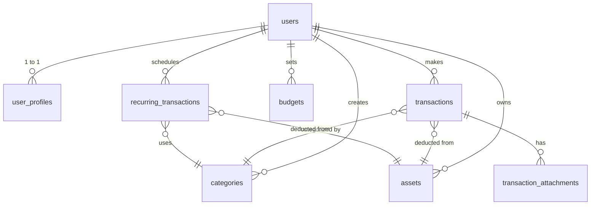
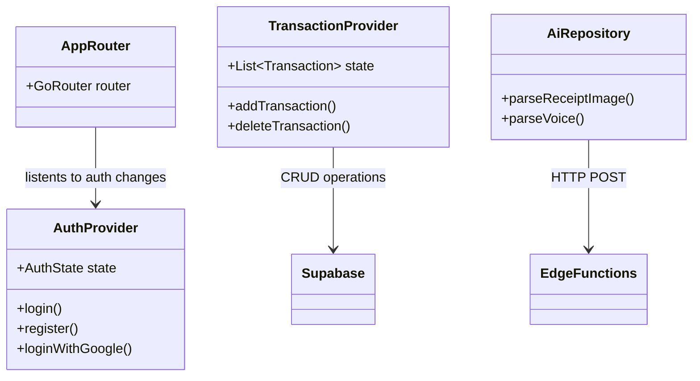

# FinAI - Intelligent Personal Financial Assistant

FinAI adalah sistem manajemen keuangan pribadi berbasis komputasi cerdas (Artificial Intelligence) yang dirancang untuk memfasilitasi pencatatan, pemantauan, dan perencanaan sirkulasi kas pengguna. Aplikasi ini mengotomatisasi proses ekstraksi data transaksi dan menyediakan analitik deskriptif untuk mendukung pengambilan keputusan finansial yang lebih terukur.

**Video Demonstrasi Aplikasi:**  
[Tautan Video Demonstrasi FinAI](#) *(Silakan sisipkan tautan YouTube atau Google Drive pada bagian ini)*

---

## Deskripsi Fungsionalitas Utama

1. **Pencatatan Berbasis Kecerdasan Buatan (AI-Driven Data Entry)**
   FinAI dilengkapi dengan modul pemrosesan citra dan suara. Pengguna dapat mengunggah foto struk transaksi atau merekam input suara. Sistem akan memproses data tersebut menggunakan model pemrosesan bahasa alami (Natural Language Processing) untuk mengekstrak nominal, kategori pengeluaran, serta detail pedagang secara terotomatisasi.

2. **Analitik Finansial Deskriptif**
   Data transaksi yang telah terekam akan divisualisasikan melalui grafik interaktif (distribusi proporsional dan tren linier). Visualisasi ini menyajikan rincian arus kas bulanan secara komprehensif, memfasilitasi pemahaman struktur pengeluaran secara empiris.

3. **Sistem Manajemen Tagihan Berkala**
   Sistem ini mengakomodasi penjadwalan transaksi berulang, seperti tagihan utilitas publik atau kewajiban pinjaman. Aplikasi akan memberikan peringatan sistem (notifikasi) secara otomatis pada siklus penagihan yang telah ditentukan.

4. **Pembatasan Anggaran (Budget Thresholding)**
   Pengguna dapat mengalokasikan batas pengeluaran spesifik untuk setiap kategori operasional. FinAI memantau realisasi anggaran secara seketika (real-time) dan akan menerbitkan peringatan apabila pengeluaran mendekati atau melampaui batas yang telah dikonfigurasi.

5. **Arsitektur Autentikasi dan Keamanan**
   Protokol akses sistem mendukung integrasi Single Sign-On (SSO) melalui akun Google, serta autentikasi hibrida berbasis One-Time Password (OTP) 6 digit via alamat email. Keamanan tingkat peranti klien diperkuat melalui lapisan autentikasi Personal Identification Number (PIN) dan pengenalan data biometrik (seperti pemindaian sidik jari).

6. **Interoperabilitas Data (Ekspor/Impor)**
   Untuk memastikan kedaulatan data pengguna, FinAI menyediakan fungsi ekspor dan impor data operasional ke dalam format spreadsheet terstandarisasi (.xlsx).

---

## Tumpukan Teknologi (Technology Stack)

- **Antarmuka Pengguna (Frontend):** Flutter (Dart) terintegrasi dengan arsitektur State Management Riverpod.
- **Infrastruktur Backend:** Supabase (mengimplementasikan PostgreSQL, modul Autentikasi, dan Object Storage).
- **Layanan Pemrosesan AI:** Deno Edge Functions terintegrasi dengan Google Gemini API.
- **Visualisasi Data:** Pustaka `fl_chart`.
- **Manajemen Navigasi:** Pustaka `go_router`.

---

## Skema Relasional Basis Data (Supabase)

Sistem ini didesain menggunakan paradigma Relational Database Management System (RDBMS). Keamanan tingkat baris data (Row Level Security/RLS) diterapkan secara ketat pada seluruh tabel operasional guna mencegah modifikasi maupun akses data yang tidak sah.

### Penjabaran Entitas Basis Data:
1. **user_profiles**: Menyimpan preferensi spesifik entitas pengguna (konfigurasi tema, hash PIN keamanan, dan rekam jejak penyelesaian orientasi sistem).
2. **categories**: Tabel referensial untuk klasifikasi arus kas (seperti konsumsi, transportasi, pendapatan). Sistem menyediakan data referensi awal secara otomatis.
3. **assets**: Mewakili entitas penyimpan nilai tukar pengguna (rekening perbankan, dompet digital, kas tunai).
4. **transactions**: Entitas sentral yang mendokumentasikan arus perpindahan dana (besaran, tipe, stempel waktu, dan keterangan tekstual).
5. **budgets**: Mencatat plafon finansial yang didefinisikan pengguna untuk entitas kategori tertentu.
6. **recurring_transactions**: Mencatat spesifikasi operasional untuk transaksi yang dieksekusi secara repetitif pada periode tertentu.

---

## Diagram Arsitektur Perangkat Lunak

Arsitektur aplikasi klien disusun dengan memisahkan lapisan antarmuka, lapisan pengelola status (State), dan lapisan repositori guna menjamin modularitas dan kemudahan pengujian.

---

Dokumen ini disusun sebagai representasi arsitektur dan kapabilitas fungsional FinAI dalam mewujudkan integrasi teknologi kecerdasan buatan pada ranah manajemen keuangan pribadi.
