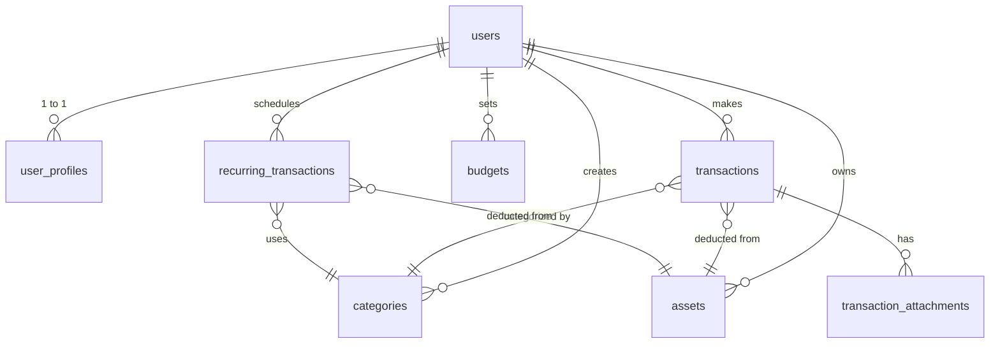
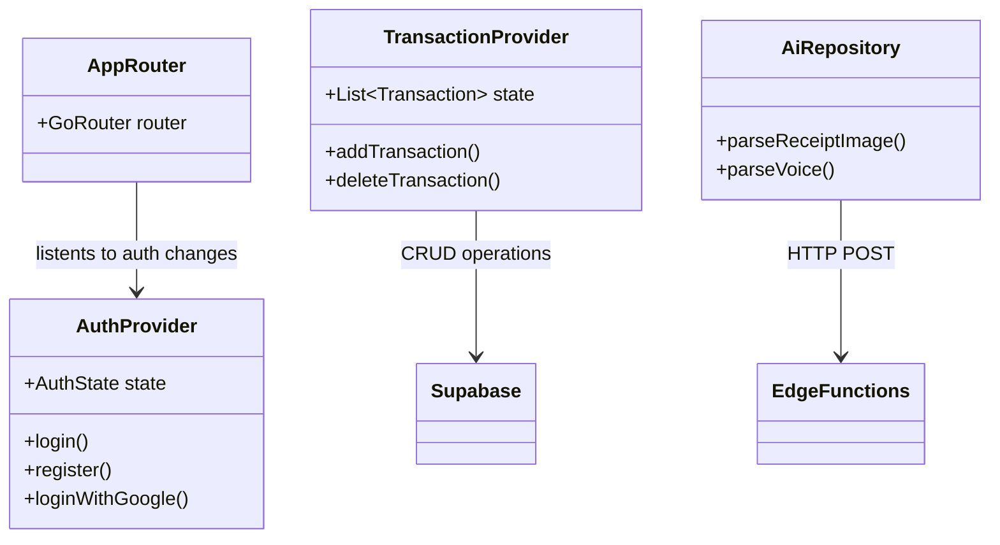

# FinAI - Asisten Keuangan Pribadi Berbasis AI 🚀

FinAI adalah aplikasi pelacak dan perencana keuangan pribadi yang dilengkapi dengan kecerdasan buatan (AI) untuk membantu Anda mencatat pengeluaran, mengatur anggaran, dan memberikan wawasan cerdas (*smart insights*) tentang kebiasaan finansial Anda.

> **🎥 Demo Aplikasi:**  
> [KLIK DI SINI UNTUK MENONTON VIDEO DEMO FINAI](#) *(Masukkan link YouTube/Google Drive Anda di sini)*

---

## ✨ Fitur Unggulan
1. **Pencatatan Cerdas (AI Scan & Voice)**: Catat transaksi hanya dengan memotret struk belanja atau mengucapkan nominal pengeluaran. AI akan mengekstrak nominal, kategori, dan pedagang secara otomatis.
2. **Analitik Interaktif**: Visualisasi *Donut Chart* dan *Bar Chart* yang memanjakan mata untuk melacak arus kas bulanan.
3. **Pengingat Rutin**: Sistem pengingat untuk tagihan bulanan (listrik, internet, cicilan) secara otomatis.
4. **Anggaran Terpusat**: Buat batas pengeluaran bulanan dan dapatkan peringatan (*alert*) jika sudah mendekati limit.
5. **Autentikasi Aman**: Mendukung *Google Sign-In*, Verifikasi Email OTP 6-Digit, serta keamanan ganda berupa PIN & Sidik Jari (Biometrik).
6. **Ekspor/Impor Excel**: Kendali penuh atas data Anda. Ekspor riwayat ke `.xlsx` atau pindahkan data dari aplikasi lain dengan mudah.

---

## 🛠️ Teknologi yang Digunakan
- **Frontend**: Flutter (Dart) & Riverpod (State Management)
- **Backend**: Supabase (PostgreSQL, Auth, Storage)
- **AI Processing**: Deno Edge Functions & Google Gemini API
- **Charts**: `fl_chart`
- **Routing**: `go_router`

---

## 🗄️ Skema Database (Supabase)

Aplikasi ini menggunakan sistem Relational Database (RDBMS) dengan keamanan Row Level Security (RLS) di setiap tabel.

### Penjelasan Tabel Inti:
1. `user_profiles`: Menyimpan data preferensi pengguna (Tema, PIN Hash, Status Onboarding).
2. `categories`: Kategori pemasukan/pengeluaran (Makanan, Transportasi, Gaji). Kategori default tersedia otomatis.
3. `assets`: Dompet atau Rekening bank pengguna (BCA, Gopay, Tunai).
4. `transactions`: Tabel utama pencatatan arus kas (Nominal, Tipe, Tanggal, dan Catatan).
5. `budgets`: Target anggaran bulanan per kategori.
6. `recurring_transactions`: Cetak biru (*blueprint*) untuk tagihan berulang.

---

## 🏗️ UML Architecture (Simplified)

---

> Dibuat dengan penuh dedikasi untuk Manajemen Keuangan Pribadi yang lebih cerdas. 💸✨
